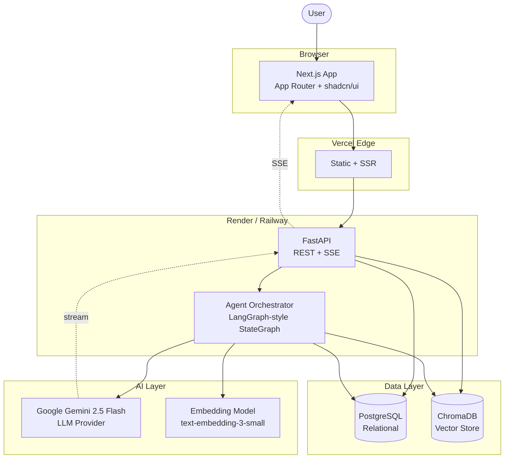
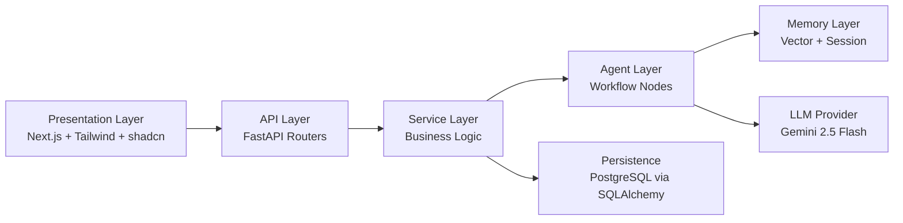
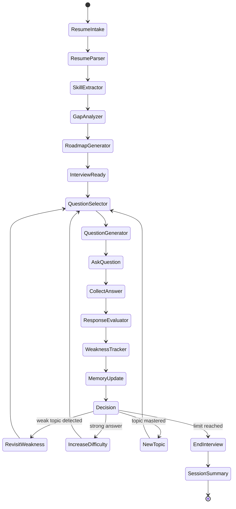
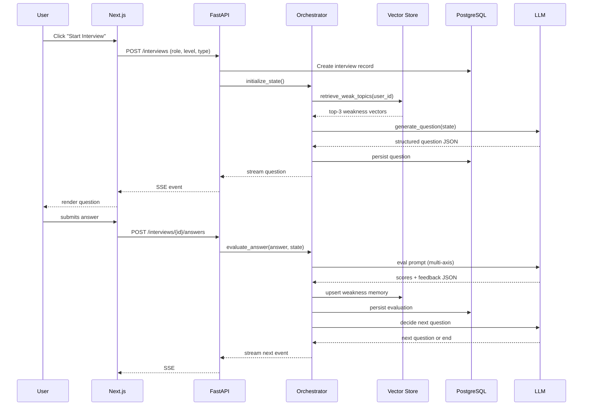
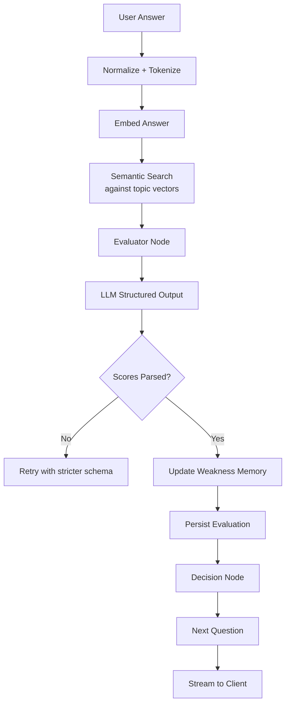
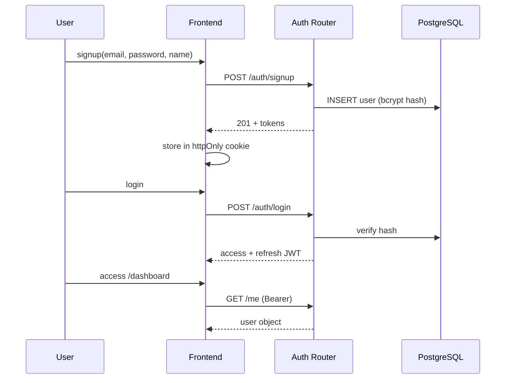
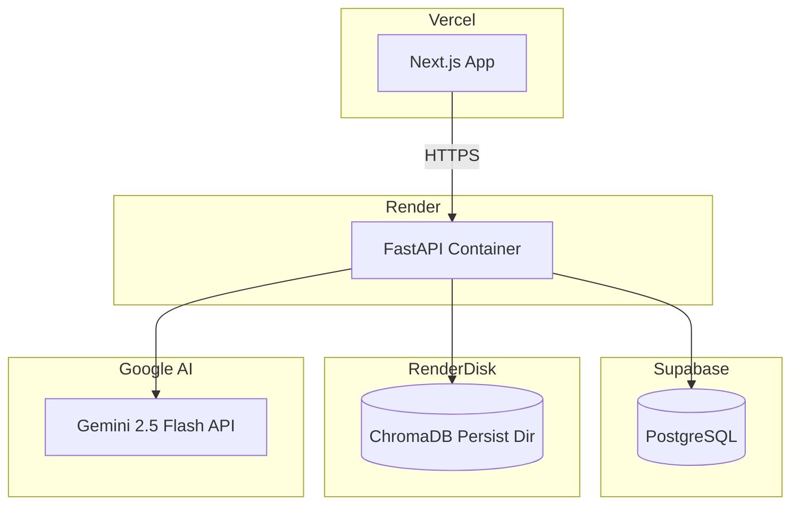

# 01 — System Architecture

This document defines the complete system architecture, component interactions, and request lifecycles for PrepMind AI.

---

## 1. High-Level System Diagram

---

## 2. Component Layers

| Layer | Responsibility | Key Modules |
| ----- | -------------- | ----------- |
| Presentation | Render UI, manage auth state, stream responses | `app/(app)/**`, `components/**` |
| API | HTTP entrypoints, request validation, auth | `app/api/v1/**` |
| Service | Orchestrate agents, persist data, transaction boundaries | `app/services/**` |
| Agent | Resume analysis, question gen, evaluation, gap analysis | `app/agents/**` |
| Memory | Short-term session state + long-term vector memory | `app/memory/**` |
| LLM | Prompted generation with structured JSON output | `app/core/llm.py` |
| Persistence | Relational data for users, interviews, evaluations | `app/models/**` |

---

## 3. Agentic Workflow Pipeline

The orchestrator is a single **StateGraph** where each node is a pure async function receiving the shared `InterviewState` and returning a partial update. This is intentionally simpler than multi-agent frameworks — we want one coherent loop, not chatty sub-agents.

---

## 4. Request Lifecycle (Mock Interview)

---

## 5. Data Flow During Interview

---

## 6. Authentication Flow

JWT is signed with HS256, access token TTL = 60 min, refresh = 14 days. Refresh rotation is enforced.

---

## 7. Deployment Topology (MVP)

ChromaDB persists to a Render persistent disk (`/var/data/chroma`). For higher scale, swap for managed `pgvector` or `pinecone`, but the abstraction in `app/memory/vector.py` is the same.

---

## 8. Architectural Principles

1. **One orchestrator, many nodes** — avoid multi-agent chaos; use a typed state graph.
2. **Structured outputs everywhere** — every LLM call returns JSON validated by Pydantic.
3. **Explainability by default** — store the *why* alongside the *what* (rationale strings).
4. **Idempotent endpoints** — safe to retry uploads, evaluations, and roadmap regenerations.
5. **No premature scaling** — single FastAPI process + single Postgres + single vector dir.

---

## 9. Where to look in the code

| Concern | Path |
| ------- | ---- |
| LLM client | `backend/app/core/llm.py` |
| Orchestrator | `backend/app/agents/orchestrator.py` |
| Resume parsing | `backend/app/agents/nodes/resume_parser.py` |
| Question gen | `backend/app/agents/nodes/question_generator.py` |
| Evaluation | `backend/app/agents/nodes/evaluator.py` |
| Memory | `backend/app/memory/vector.py` |
| Prompts | `backend/app/prompts/*.py` |
