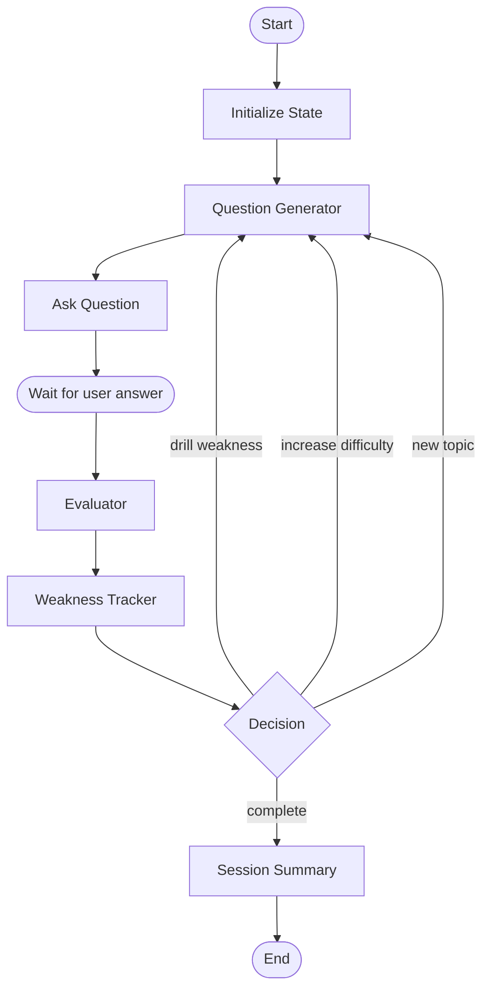

# 06 — AI Workflows & Prompts

This is the heart of PrepMind AI. The platform uses a **single stateful orchestrator** composed of typed nodes. Each node is a pure async function that takes the current `InterviewState` and returns a partial update. LLM calls always return **structured JSON** validated by Pydantic.

---

## 1. State Definition

```python
# app/agents/state.py
from typing import TypedDict, List, Optional, Literal

Difficulty = Literal["easy", "medium", "hard", "expert"]

class QuestionRecord(TypedDict):
    id: str
    turn_index: int
    topic: str
    difficulty: Difficulty
    prompt: str
    expected_answer: Optional[str]

class EvaluationRecord(TypedDict):
    question_id: str
    correctness_score: int
    clarity_score: int
    depth_score: int
    confidence_score: int
    feedback: str
    ideal_answer: str
    rubric: dict

class InterviewState(TypedDict):
    user_id: str
    interview_id: str
    role: str
    level: str
    topic_focus: Optional[str]

    # History
    questions: List[QuestionRecord]
    evaluations: List[EvaluationRecord]

    # Live state
    current_question: Optional[QuestionRecord]
    current_difficulty: Difficulty
    current_topic: str

    # Memory pointers
    weak_topics: List[str]
    mastered_topics: List[str]

    # Bookkeeping
    turn: int
    max_turns: int
    is_complete: bool

    # Exposed to UI for "what is the AI thinking"
    last_rationale: str
```

---

## 2. Orchestrator Graph



Each edge is a state transition. The Decision node picks the next action based on rolling scores and memory.

---

## 3. Node Specifications

### 3.1 Resume Parser

**Input:** raw PDF text  
**Output:** structured profile JSON

```python
class ResumeProfile(BaseModel):
    summary: str
    experience: list[dict]   # [{title, company, duration, bullets}]
    education: list[dict]
    projects: list[dict]
    skills: list[str]
```

Uses PyPDF for text extraction → calls LLM with the `resume_parse` prompt → validates with Pydantic. Retries once on JSON parse failure.

### 3.2 Skill Gap Analyzer

**Input:** profile skills + target role/level  
**Output:** matched, missing, weak skills + readiness score

```python
class GapAnalysis(BaseModel):
    matched: list[SkillScore]
    missing: list[SkillScore]
    weak: list[SkillScore]
    readiness_score: float   # 0..100
    rationale: str
```

`readiness_score` formula (deterministic, post-LLM):
```
score = 0.6 * coverage + 0.4 * avg_proficiency
coverage = len(matched) / max(1, len(matched) + len(missing))
```

### 3.3 Question Generator

**Input:** state + retrieved weakness context  
**Output:** next question JSON

```python
class GeneratedQuestion(BaseModel):
    topic: str
    difficulty: Difficulty
    prompt: str
    expected_answer: str
    rationale: str
```

Prompt injects:
- Target role & level
- User's matched & weak skills
- Top 3 weakness topics from vector memory
- Last question + last evaluation (to avoid repeats)
- Difficulty directive ("medium" / "hard" / "drill this concept")

### 3.4 Evaluator

**Input:** question + user answer + optional ideal answer  
**Output:** multi-axis evaluation

```python
class Evaluation(BaseModel):
    correctness_score: int  # 0-100
    clarity_score: int
    depth_score: int
    confidence_score: int
    feedback: str
    ideal_answer: str
    rubric: dict
    suggested_followup: Optional[str]
```

Scoring rubric is enforced via few-shot examples in the prompt.

### 3.5 Weakness Tracker

- Computes a per-topic weakness delta: `weakness += (100 - correctness_score) * weight`.
- Upserts an embedding to ChromaDB tagged with topic + weakness score.
- If `weakness_score > 0.7`, the topic enters `weak_topics`.

### 3.6 Decision Node

Picks the next action using this priority:

```
if any weak topic attempted < 3 times:
    action = "drill_weakness"
elif avg(score of last 2) >= 80 and current_difficulty != "expert":
    action = "increase_difficulty"
elif current_topic mastered (score >= 85 twice):
    action = "new_topic"
elif turn >= max_turns:
    action = "complete"
else:
    action = "continue"  # default adaptive flow
```

### 3.7 Roadmap Generator

**Input:** profile, gap analysis, recent evaluations  
**Output:** 30-day plan JSON

```python
class Roadmap(BaseModel):
    duration_days: int
    weeks: list[Week]
    projects: list[Project]
    rationale: str

class Week(BaseModel):
    week: int
    focus: str
    tasks: list[Task]

class Task(BaseModel):
    day: int
    title: str
    type: Literal["study", "practice", "project", "mock"]
    minutes: int
    resource: Optional[str]

class Project(BaseModel):
    name: str
    description: str
    why: str
```

---

## 4. Prompt Library (Templates)

All prompts live in `app/prompts/*.py` as plain string constants. They include `{placeholders}` that are filled at call time.

### `resume_parse.py`

```
You are a precise resume parser. Extract a clean, structured JSON profile from the resume text below.

Return JSON matching this schema:
{schema}

Rules:
- Use concise phrases, not full sentences.
- Normalize skill names to canonical forms (e.g. "React.js" → "React").
- For projects, include name, description (1 line), and tech stack.
- If a section is missing, return [].
- Do not invent information.

Resume:
\"\"\"
{resume_text}
\"\"\"
```

### `gap_analysis.py`

```
You are a senior engineering interviewer evaluating readiness for a {role} ({level}) role.

User skills (from resume): {user_skills}
Common required skills for this role: {role_skill_baseline}

Task: produce a JSON GapAnalysis with:
- matched: skills the user has
- missing: skills the user lacks that are important
- weak: skills the user has but with low proficiency evidence
- rationale: 2–3 sentences

Schema: {schema}
```

### `question_generate.py`

```
You are interviewing a candidate for a {role} ({level}) role.
Current turn: {turn}/{max_turns}. Last difficulty: {difficulty}.

Candidate profile (summary): {profile_summary}
Matched skills: {matched}
Weak skills: {weak}
Memory: previously weak topics = {weak_topics}
Last question: {last_question}
Last evaluation: {last_eval}
Directive for this turn: {directive}    # e.g. "drill: caching" / "increase difficulty" / "new topic"

Generate ONE question. Be specific. Avoid trivia. Prefer applied/scenario questions.

Return JSON:
{schema}
```

### `evaluate.py`

```
You are evaluating a candidate's answer.

Question: {question}
Ideal answer (for reference): {expected_answer}
Candidate answer: {user_answer}

Score on 0–100 across FOUR axes:
- correctness: factual & technical accuracy
- clarity: structure, articulation, conciseness
- depth: nuance, trade-offs, edge cases
- confidence: assertiveness without overclaiming (based on phrasing)

Return JSON:
{schema}

Guidance:
- 90+ = exemplary, 75–89 = strong, 60–74 = solid, 40–59 = weak, <40 = lacking
- In feedback, ALWAYS start with one specific thing done well, then 1–3 concrete improvements.
- Be honest, not flattering.
```

### `decision.py`

```
You are an adaptive interview controller.

History: {history_json}
Weak topics from memory: {weak_topics}
Current difficulty: {difficulty}

Decide the NEXT action. Return JSON:
{ "action": "drill_weakness"|"increase_difficulty"|"new_topic"|"continue"|"complete",
  "target_topic": "..." or null,
  "target_difficulty": "easy"|"medium"|"hard"|"expert",
  "rationale": "1 sentence" }
```

### `roadmap.py`

```
You are a senior mentor creating a 30-day prep plan for a {role} ({level}) role.

User profile: {profile}
Gap analysis: {gap}
Recent evaluation summary: {eval_summary}

Produce a 4-week plan. Each week has a clear focus. Each task is specific and time-boxed (15–90 min). Include 2–3 portfolio projects relevant to the role.

Return JSON: {schema}
```

---

## 5. Structured Output Strategy

- Use **structured JSON output** (prompt-instructed + schema-in-context) for all structured calls.
- Embed the target schema in the prompt as a JSON example — Pydantic re-validates the response.
- On validation failure, retry once with a *correction prompt*: "Your previous output failed validation. Error: ... Fix and return valid JSON."
- Cap retries at 2 to keep latency bounded; fall back to safe defaults.

---

## 6. Memory & Retrieval

```python
# app/memory/vector.py
class VectorMemory:
    def __init__(self):
        self.client = chromadb.PersistentClient(path="./chroma")
        self.col = self.client.get_or_create_collection("user_memory")

    def upsert_weakness(self, user_id: str, topic: str, content: str, score: float):
        vid = f"{user_id}:{topic}"
        self.col.upsert(
            ids=[vid],
            documents=[content],
            metadatas=[{"user_id": user_id, "topic": topic, "weakness": score}],
            embeddings=[embed(content)],
        )

    def get_top_weak(self, user_id: str, k: int = 3) -> list[dict]:
        res = self.col.query(
            query_embeddings=[embed(f"{user_id} weak topics")],
            where={"user_id": user_id},
            n_results=k,
        )
        return parse(res)
```

Weakness retrieval uses a **hybrid**: semantic similarity + a metadata sort on the `weakness` field. This avoids the LLM drifting toward thematically related but actually-mastered topics.

---

## 7. Adaptive Difficulty Logic

| Condition | Adjustment |
| --------- | ---------- |
| Avg score of last 2 ≥ 80 | bump difficulty up |
| Avg score of last 2 ≤ 50 | bump difficulty down |
| Same topic failed ≥ 2 times | keep difficulty, switch question type to *applied* |
| Topic mastered (≥ 85 twice) | mark mastered, exclude from next 3 turns |

Difficulty is a *directive*, not a hard constraint — the LLM can override if the topic doesn't have harder variants.

---

## 8. Latency Budget

| Step | Budget |
| ---- | ------ |
| Question gen (LLM) | ≤ 2.5s p50 |
| Eval (LLM) | ≤ 3.0s p50 |
| Embedding + vector query | ≤ 250ms |
| DB writes | ≤ 50ms |
| **Total turn** | **≤ 6s end-to-end** |

We stream question generation to the client via SSE so the user sees the prompt before full generation completes.

---

## 9. Cost Discipline

- Default model: **Gemini 2.5 Flash** for every LLM call (question gen, eval, decision, roadmap, parse).
- Cache embeddings of canonical skill names.
- Cap conversation context in prompts (rolling window of last 4 turns).
- Add a hard daily per-user LLM budget (e.g. 200 turns/day) — soft warn at 80%.
